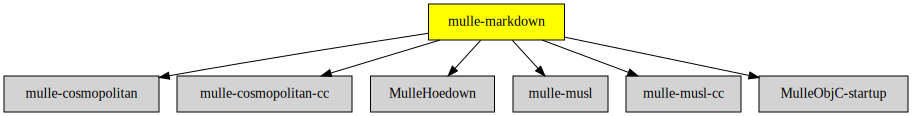

# mulle-markdown

#### 👯 mulle-markdown turns markdown into HTML

**mulle-markdown** uses the [hoedown](//github.com/hoedown/hoedown)
library wrapped into [MulleHoedown](//github.com/MulleWeb/MulleHoedown) to
convert [Markdown](//en.wikipedia.org/wiki/Markdown) into
[HTML](https://en.wikipedia.org/wiki/HTML).

You can get `mulle-markdown` to add a stylesheet to your HTML output. That
makes it convenient for quick previewing of markdown files.


## Executables

| Executable               | Description                                                 |
|--------------------------|-------------------------------------------------------------|
| `mulle-markdown`         | Markdown to HTML converter                                  |
| `mulle-markdown-preview` | Render markdown into temporary file and open in web browser |


## Usage

```
Usage:
   mulle-markdown [options]

   Reads markdown from stdin, writes it to stdout.

Options:
   -c         : emit link to "style.css" (implies -w)
   -i         : inline "style.css" into HTML head (implies -w)
   -m         : inline a hardcoded style.css (implies -w)
   -t <title> : set title of HTML document (implies -w)
   -w         : wrap with HTML header and footer
   --version  : print program version and exit
```


## Example

### Preview README.md

Produces a nicely styled and readable HTML output file and open it in a
browser (linux/macos):


``` console
mulle-markdown-preview README.md
```

### Arbitrary markdown

```console
echo "# hello" | mulle-markdown -c
```

emits

```html
<html>
<head>
<link rel="stylesheet" href="style.css">
</head>
<body>
<h1>hello</h1>
</body>
</html>
```

> ### Note
>
> mulle-markdown does not pretty print the resulting HTML. You may want to
> chain it with mulle-tidy for nicer output.


## mulle-markdown as a musl or cosmopolitan static executable

`mulle-markdown` is a small showcase on how to compile mulle-objc with
[musl](//musl.libc.org) or [cosmopolitan](//justine.lol/cosmopolitan/index.html)
into a standalone static/cross-platform executable. The craft for musl or
cosmopolitan must be done on linux though.
The C libraries are considered SDKs and can be selected with:

``` sh
mulle-sde env --os-linux set MULLE_CRAFT_SDKS "cosmopolitan:musl:default"
```
> #### SDK selection via sourcetree
>
> See `mulle-sourcetree list --output-format cmd` on how to add cosmopolitan or
> musl to a sourcetree. Pay attention to the `only-craft-sdk-<name>`
> marks.
>


### You are here




## Add

Use [mulle-sde](//github.com/mulle-sde) to add mulle-markdown to your project:

``` sh
mulle-sde add github:MulleWeb/mulle-markdown
```

## Install

### Install with mulle-sde

Use [mulle-sde](//github.com/mulle-sde) to build and install mulle-markdown and all dependencies:

``` sh
mulle-sde install --prefix /usr/local \
   https://github.com//mulle-markdown/archive/latest.tar.gz
```

### Manual Installation

Install the requirements:

| Requirements                                 | Description
|----------------------------------------------|-----------------------
| [mulle-cosmopolitan](https://github.com/mulle-cc/mulle-cosmopolitan)             | 
| [mulle-cosmopolitan-cc](https://github.com/mulle-cc/mulle-cosmopolitan-cc)             | 🎪 Cosmopolitan variants of gcc, clang, mulle-clang for mulle-cosmopolitan
| [mulle-musl](https://github.com/mulle-cc/mulle-musl)             | 🐚 Build the musl C library for static executables
| [mulle-musl-cc](https://github.com/mulle-cc/mulle-musl-cc)             | 🐚 Add -static flag to musl-gcc (and clang)
| [MulleHoedown](https://github.com/MulleWeb/MulleHoedown)             | 💃🏼 Markdown support for mulle-objc
| [MulleObjC-startup](https://github.com/mulle-objc/MulleObjC-startup)             | ▶️  Startup code for MulleObjC

Download the latest [tar](https://github.com/MulleWeb/mulle-markdown/archive/refs/tags/latest.tar.gz) or [zip](https://github.com/MulleWeb/mulle-markdown/archive/refs/tags/latest.zip) archive and unpack it.

Install **mulle-markdown** into `/usr/local` with [cmake](https://cmake.org):

``` sh
PREFIX_DIR="/usr/local"
cmake -B build                               \
      -DMULLE_SDK_PATH="${PREFIX_DIR}"       \
      -DCMAKE_INSTALL_PREFIX="${PREFIX_DIR}" \
      -DCMAKE_PREFIX_PATH="${PREFIX_DIR}"    \
       -DCMAKE_BUILD_TYPE=Release &&
cmake --build build --config Release &&
cmake --install build --config Release
```

### Platforms and Compilers

All platforms and compilers supported by
[mulle-c11](//github.com/mulle-c/mulle-c11).


## Author

[Nat!](https://mulle-kybernetik.com/weblog) for Mulle kybernetiK  

